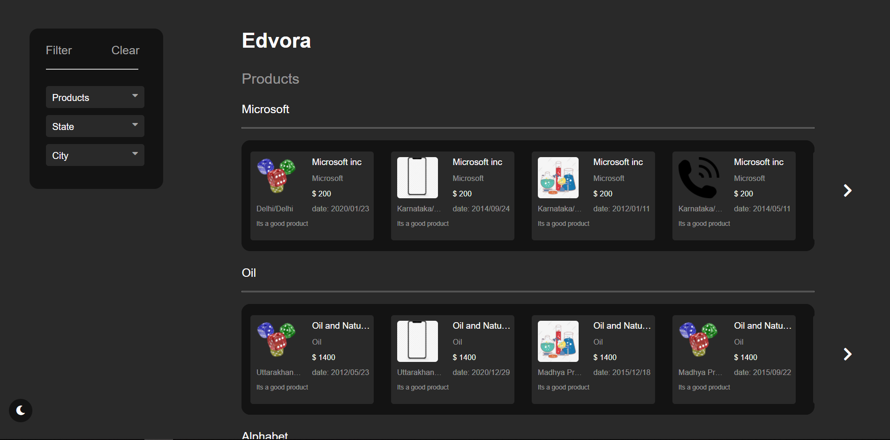
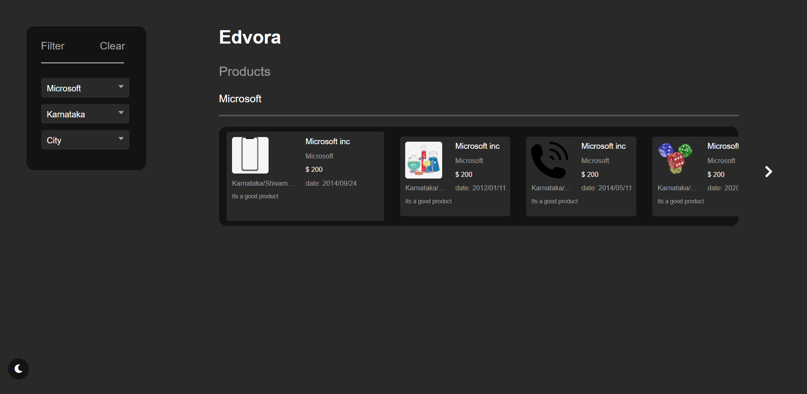
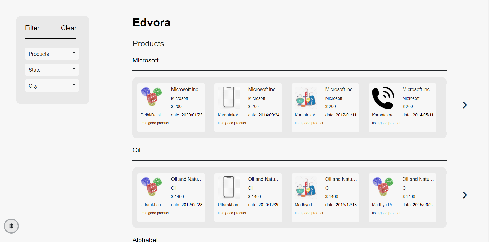
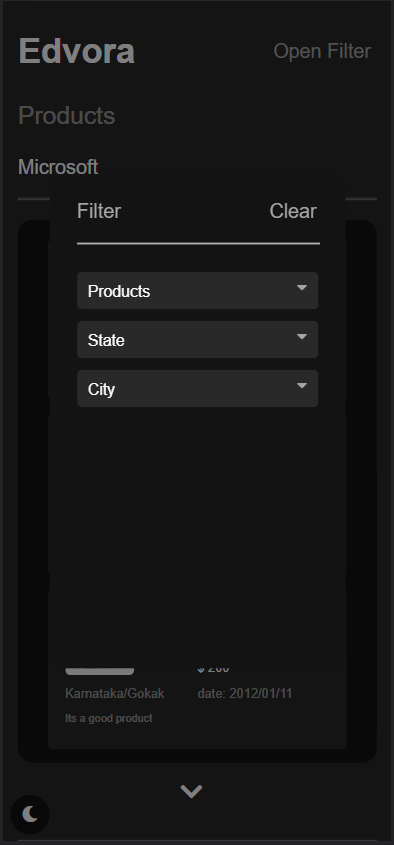

# Edvora assessment


## 🏁 Get Started <a name = "Install"></a>

```
git clone https://github.com/gaserashraf/Edvora-assessment.git
```
```
npm i
```
```
npm start
```
## 💻 Built Using <a name = "tech"></a>
- **React**
- **SASS**
- **MUI react**
- **Bootstrap4**
## 📷 Screenshots

<div name="Screenshots" align="center">
   </a>
   </a>
   <hr>
   <h2 align='left'>light theme</h2>
   </a>
   <hr>
   <h2 align='left'>resopnsive</h2>
   </a>
   </a>
</div>

## File Structure <a name = "file"></a>


<!-- tree generated by markdown-notes-tree starts here -->
```
─ src
   ├─ assets
   │  ├─ arrow.png
   │  └─ README.md
   ├─ components
   │  └─ README.md
   ├─ contexts
   │  ├─ productContext.js
   │  ├─ README.md
   │  └─ Service.js
   ├─ styles
   │  ├─ README.md
   │  ├─ styles.css
   │  └─ styles.css.map
   ├─ components
   │  ├─ filterComponent
   │  │  ├─ README.md
   │  │  └─ View.jsx
   │  ├─ homeComponent
   │  │  ├─ README.md
   │  │  └─ View.jsx
   │  └─ productsComponent
   │     ├─ README.md
   │     └─ View.jsx
   ├─ styles
   │  └─ scss
   │     ├─ README.md
   │     └─ styles.scss
   └─ components
      ├─ filterComponent
      │  └─ containers
      │     ├─ FilterDropdown.jsx
      │     ├─ FilterDropdownMenu.jsx
      │     ├─ FilterPopup.jsx
      │     └─ README.md
      ├─ homeComponent
      │  └─ containers
      │     ├─ DarkModeBtn.jsx
      │     └─ README.md
      └─ productsComponent
         └─ containers
            ├─ Loader.jsx
            ├─ ProductContainer.jsx
            ├─ ProductItem.jsx
            └─ README.md

```
<!-- tree generated by markdown-notes-tree ends here -->
